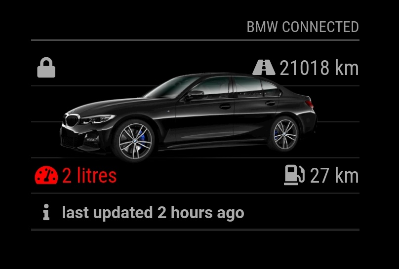

# MMM-BMWConnected
Magic Mirror Module to display data from BMW Connected drive for your car.

The module displays icons to show lock, fuel, door, windows and sunroof status, range, and total kms driven. It also shows the time the Connected Drive API last received data from the car.

## Installation

Clone this repository in your modules folder, and install dependencies:

    cd ~/MagicMirror/modules 
    git clone https://github.com/philmavedzenge/MMM-BMWConnected.git
    cd MMM-BMWConnected
    npm install 

## Configuration

Go to the MagicMirror/config directory and edit the config.js file. Add the module to your modules array in your config.js.

You'll need your BMW Connected Drive email and password.

Enter these details in the config.js for your MagicMirror installation:

    {
        module: "MMM-BMWConnected",
        header: 'BMW Connected',
        position: "bottom_right",
        config: {
            email: "yourBMWConnectEmail",
            password: "StrongPassword",
	    apiBase: "www.bmw-connecteddrive.co.za", //this works for me in South Africa not sure what other regions would be
            distance: "km",
            refresh: 15,
            vehicleAngle: 10,
	    country: "South Africa", //Type exactly as it appears on https://www.bmw-connecteddrive.com/
	    region: "REST_OF_WORLD" //Choose one : NORTH_AMERICA,CHINA,REST_OF_WORLD
        }
    },

## Module configuration
The module has a few configuration options:

<table>
  <thead>
    <tr>
      <th>Option</th>
      <th>Description</th>
    </tr>
  </thead>
  <tbody>
    <tr>
      <td><code>email</code></td>
      <td>Your username or email for the BMW Connected Drive platform.  <strong>Default: </strong><code>undefined</code></td>
    </tr>
        <tr>
      <td><code>password</code></td>
      <td>Your password for the BMW Connected Drive platform.  <strong>Default: </strong><code>undefined</code></td>
    </tr>
        <tr>
      <td><code>apiBase</code></td>
      <td>apiBase url for your country.  <strong>Default: </strong><code>www.bmw-connecteddrive.co.za</code></td>
    </tr>
            <tr>
      <td><code>country</code></td>
      <td>Your BMWConnect registration country.  <strong>Check: </strong><code>https://www.bmw-connecteddrive.com/</code></td>
    </tr>
    <tr>
      <td><code>refresh</code></td>
      <td>How often to refresh the data in minutes.   <strong>Default: </strong><code>15</code> </td>
    </tr>
        <tr>
      <td><code>vehicleAngle</code></td>
      <td>The initial angle of rotation for the car image.   <strong>Default: </strong><code>300</code> Between 0 and 350 in increments of 10.</td>
    </tr>
            <tr>
      <td><code>distance</code></td>
      <td>The unit of distance used for mileage and range.   <strong>Default: </strong><code>miles</code> Can be: miles or km.</td>
    </tr>
  </tbody>
</table>

## Notes

If possible the module will pull an image of your car from BMW's API. I only have one BMW, so can't test the placement/graphics of other vehicles. I'd love to see what it looks like if you try it.  
## No Data?

Contact me and i will try to help as best as i can. PLease note that i'm not the original developer of this module. I have just forked it and made a few changes.

## Help

I have not tested for other regions except for REST_OF_WORLD, if you can, please test and let me know.

## Thanks

Hat tip to [Howard Durdle](https://hdurdle/MMM-BMWConnected) for the original code.
